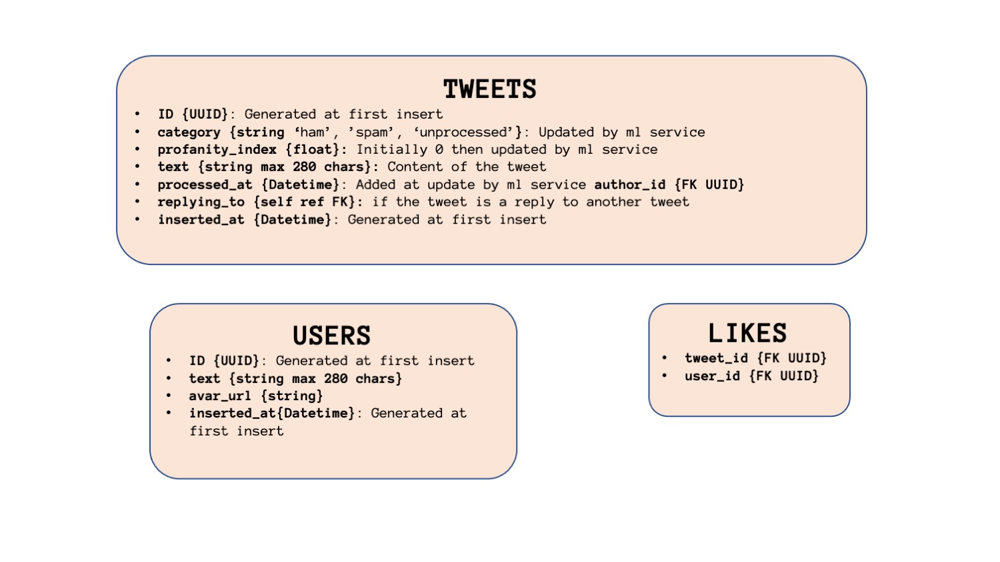

# Twitter Clone with Machine Learning Moderation


This educational project aims to show how social medias can be can moderated using AI systems.

We chose to produce a "Twitter Clone" using [React.js](reactjs.org) as frontend backed by a [Spring Boot](https://spring.io/projects/spring-boot) REST API (with a PostgreSQL database) and a ML ([sklearn](https://scikit-learn.org/stable/)) python service. The application processes new touits by identifying if they are **spam** and adding a language **profanity score**.

The frontend was copied and modified from: [https://github.com/psatler/twitter-clone-react](https://github.com/psatler/twitter-clone-react) and the backend was developped to fullfil redux store's requirements and persisting the user and touit data.

## Application Overview

### Architecture


The components of the architecture are containerized using [Docker](https://www.docker.com/); the webapp, the REST api and ML service are deployed on an on-premise kubernetes cluster.

### Application Model/Entities

The database model can be illustrated by the following figure:



## Repository Structure

Each component/service of this project can be found in separate directories of this repository containing a service specific README and its source code.

* [`dataset/`](./dataset): contains the CSV dataset used by the jupyter notebooks of the project.
* [`docs/`](./docs): includes the figures and pictures used in the documentation/READMEs of this repository.
* [`notebooks/`](./notebooks): jupyter notebooks used for the data analyis of the datasets and the training of the Modbot 🤖 (the moderation algorithm) model.
* [`ops/`](./ops): contains several [docker-compose](https://docs.docker.com/compose/) that can be used to create the PostgreSQL, Keycloak (the authentifcation software, not implemented yet) and the RabbitMQ instances used by the different components of the application.
* [`python-ml-service/`](./python-ml-service) contains Modbot 🤖, the python service that receives the Touits to process from a RabbitMQ (message queue).
* [`react-webapp`](./react-webapp) the frontend of the application.
* [`spring-microservice`](./spring-microservice) the central java backend of the application that provides several HTTP REST endpoints for the frontend and desposits new touits onto the message queue.
* [`sql/`](./sql) the SQL scripts code to generate and populate the database schema used by the application.


## Environment variables

The application's services and the docker-compose files of [ops/](./ops) require many different environement variables that need to be shared between services (PostgreSQL/RabbitMQ connections strings, usernames, passwords, frontend url...).

The easiest way to deal these environement variables is to create at the base of this repository a bash filled that exported environement varibles.


Create a `.env` and put the following content (replace the `<Variable explanation>` values by the actual variables of environement (local or production).
```bash
# .env

## KEYCLOAK SPECIFIC
export REALM_NAME=# <KEYCLOAK REALM, example value: `touitter-ml-app`>
export KEYCLOAK_SERVER_URL=# <KEYCLOAK INSTANCE URL, example value: `http://localhost:8443`>
export CLIENT_ID=# <KEYCLOAK CLIENT ID for the java Spring Boot REST API, example value: `springboot-microservice`>
export CLIENT_SECRET=# <KEYCLOAK CLIENT SECRET generated when creating a new keycloak client, example value: `aaaa1234-abc-1abc-1234-abcdefgh1234`>
export KEYCLOAK_USER=# <KEYCLOACK USER for the Keycloak Server instance to create with ops/keycloak-compose.yaml>
export KEYCLOAK_DATABASE=# <KEYCLOACK USER DATABASE for the PostgreSQL instance to create with ops/keycloak-compose.yaml>
export KEYCLOAK_PASSWORD=# <KEYCLOACK USER PASSWORD for the Keycloak Server instance to create with ops/keycloak-compose.yaml>
export DATABASE_ROOT_PASSWORD==# <DATABASE PASSWORD>
## KEYCLOAK SPECIFIC (if using SSL)
export CERTIFICATE_PATH=# <KEYCLOAK SERVER PATH TO SSL CERTIFICATE, example value: `/etc/letsencrypt/live/keycloak.example.com/fullchain.pem`>
export PRIVKEY_PATH=# <KEYCLOAK SERVER PATH TO CERTIFICATE PRIVATE KEY, example value: `/etc/letsencrypt/live/keycloak.example.com/privkey.pem`>

## POSTGRESQL SPECIFIC
export POSTGRESQL_DATABASE_NAME=# <POSTGRESQL DATABASE, name of the PostgreSQL database created before generating the schema, example value: `touitter_db`>
export POSTGRESQL_PORT=# <POSTGRESQL PORT, port to connect the PostgreSQL instance, example value: `5432`>
export POSTGRESQL_URL=# <POSTGRESQL URL, base url of the PostgreSQL instance, example value: `localhost`>
export POSTGRESQL_USER=# <POSTGRESQL USER, PostgreSQL user that has read, write access to the database, example: `touitter-db-user`>
export POSTGRESQL_PASSWORD==# <POSTGRESQL PASSWORD, password of the user that has read, write access to the database>

export WEBAPP_URL=# <FRONTEND URL, base url of the webapp, example value: `http://localhost:3000`>

## RABBITMQ SPECIFIC
export MQ_HOST=# <RABBITMQ INSTANCE URL without the port, example value: `http://localhost`>
export MQ_USER=# <RABBITMQ USER, example value: `admin`>
export MQ_PASSWORD=# <RABBITMQ PASSWORD of the above user>
export MQ_QUEUE=# <RABITMQ QUEUE name used by all of the services>
```

