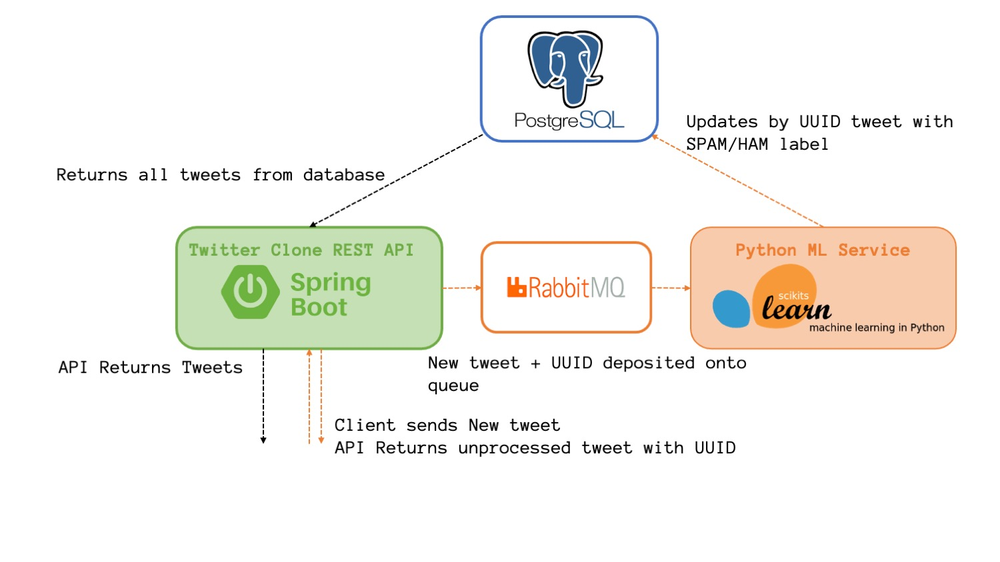

# Twitter Clone with Machine Learning Moderation

This educational project aims to show how social medias can be can moderated using AI systems.

We chose to produce a "Twitter Clone" using [React.js](reactjs.org) as frontend backed by a [Spring Boot](https://spring.io/projects/spring-boot) REST API (with a PostgreSQL database) and a ML ([sklearn](https://scikit-learn.org/stable/)) python service. The application clones processes new tweets by identifying if they are **spam** and adding a language **profanity score**.

## Live Demo

A live version of the web application project can be viewed [here](https://touitter.k8s.pouretadev.com/).

**WIP**: Please note that there isn't any authentication and that the SSL certificate isn't 100% valid (which is why you may get a browser warning when accessing the website).

The frontend was copied and modified from: [https://github.com/psatler/twitter-clone-react](https://github.com/psatler/twitter-clone-react) and the backend was developped to fullfil the .

## Application Overview

### Architecture

The components of the architecture are containerized using Docker; the webapp, the REST api and ML service are deployed on an on-premise kubernetes cluster.

### Application Model/Entities

