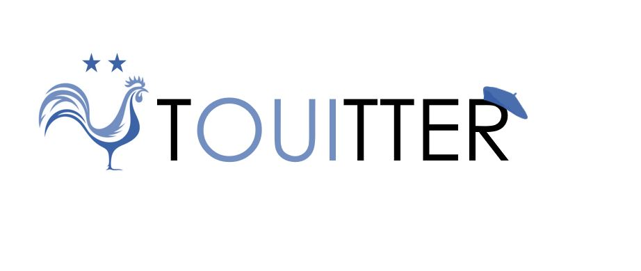

# Twitter Clone with Machine Learning Moderation

This educational project aims to show how social medias can be can moderated using AI systems.

We chose to produce a "Twitter Clone" using [React.js](reactjs.org) as frontend backed by a [Spring Boot](https://spring.io/projects/spring-boot) REST API (with a PostgreSQL database) and a ML ([sklearn](https://scikit-learn.org/stable/)) python service. The application processes new touits by identifying if they are **spam** and adding a language **profanity score**.

## Live Demo

A live version of the web application project can be viewed [here](https://touitter.k8s.pouretadev.com/).

**WIP**: Please note that there isn't any authentication and that the SSL certificate isn't 100% valid (which is why you may get a browser warning when accessing the website).

The frontend was copied and modified from: [https://github.com/psatler/twitter-clone-react](https://github.com/psatler/twitter-clone-react) and the backend was developped to fullfil redux store's requirements and persisting the user and touit data.

## Application Overview

### Architecture

The components of the architecture are containerized using [Docker](https://www.docker.com/); the webapp, the REST api and ML service are deployed on an on-premise kubernetes cluster.

### Application Model/Entities

The database model can be illustrated by the following figure:

## Repository Structure

Each component/service of this project can be found in separate directories of this repository containing a service specific README and its source code.

* [`dataset/`](./dataset): contains the CSV dataset used by the jupyter notebooks of the project.
* [`docs/`](./docs): includes the figures and pictures used in the documentation/READMEs of this repository.
* [`notebooks/`](./notebooks): jupyter notebooks used for the data analyis of the datasets and the training of the Modbot 🤖 (the moderation algorithm) model.
* [`ops/`](./ops): contains several [docker-compose](https://docs.docker.com/compose/) that can be used to create the PostgreSQL, Keycloak (the authentifcation software, not implemented yet) and the RabbitMQ instances used by the different components of the application.
* [`python-ml-service/`](./python-ml-service) contains Modbot 🤖, the python service that receives the Touits to process from a RabbitMQ (message queue).
* [`react-webapp`](./react-webapp) the frontend of the application.
* [`spring-microservice`](./spring-microservice) the central java backend of the application that provides several HTTP REST endpoints for the frontend and desposits new touits onto the message queue.
* [`sql/`](./sql) the SQL scripts code to generate and populate the database schema used by the application.
